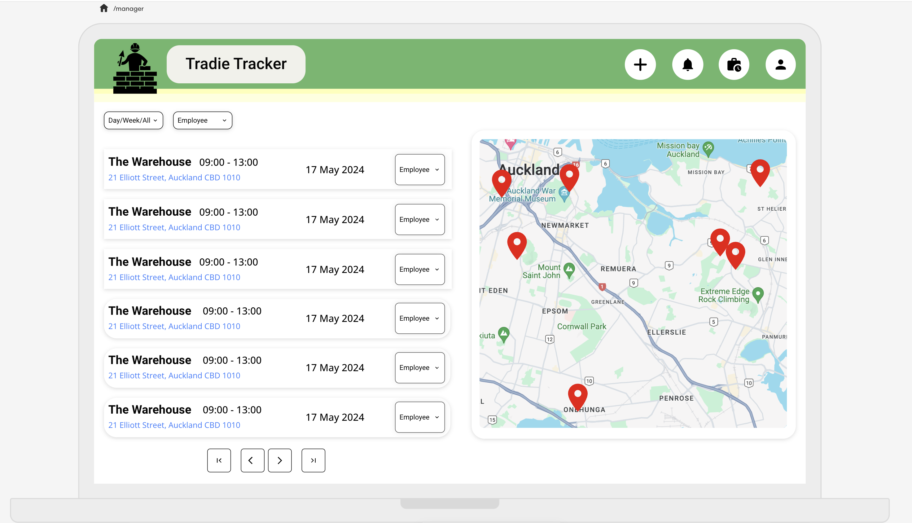

# Tradie-Trackeer

<b>Efficient Work Scheduling App.</b><br>
This project is from group project from Dev Academy, and I am remaking from the scratch to consolidate the concepts and make clear code. The idea was to make a scheduling app using all the tools including front & backend skills we've learnt throughout the bootcamp, and I took a front-end lead.

### Goal

Use backend and frontend routes to save and filter data.

## Role

* Front-end routing
* Component management
* Naming functions 

### While rearranging...

* matched front & backend routing and function names
* rearranged Pages & Components


## Setup

### Installation and migrations

- [ ] Install packages, run migrations and seeds, and start the dev server with `npm run dev`

  ```
  npm install
  npm run knex migrate:latest
  npm run knex seed:run
  npm run dev
  ```

## Skill

* HTML
* CSS
* JavaScript
* React
* Knex
* SQLite3

## To be improved

Media query screen

## Stretch Goal

Google map api implementation<br>



